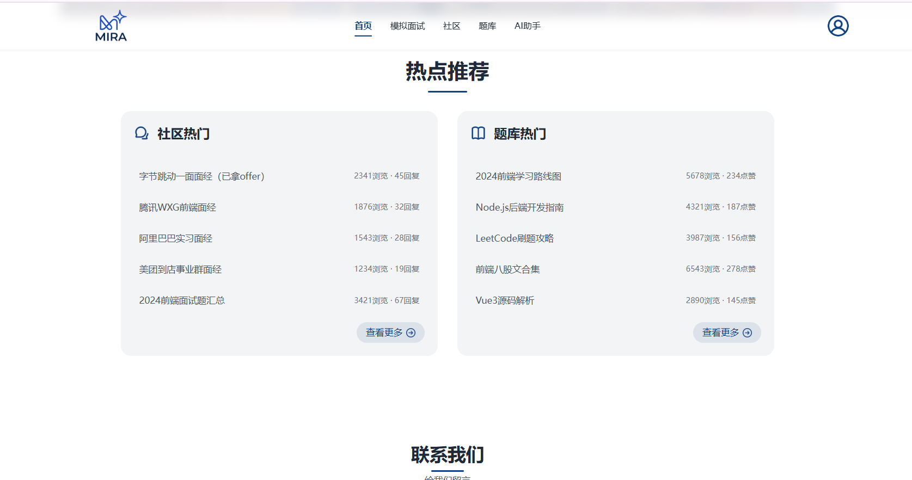
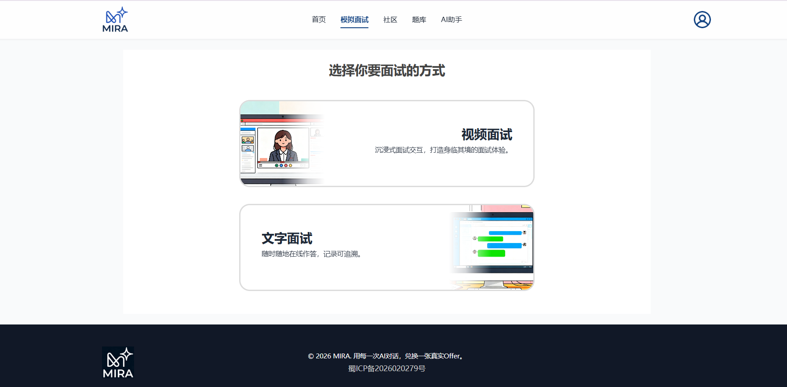
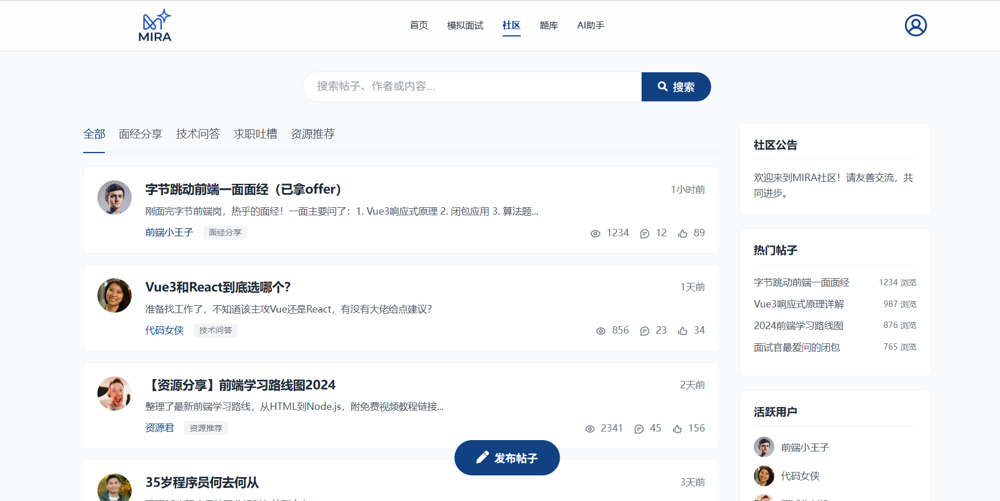
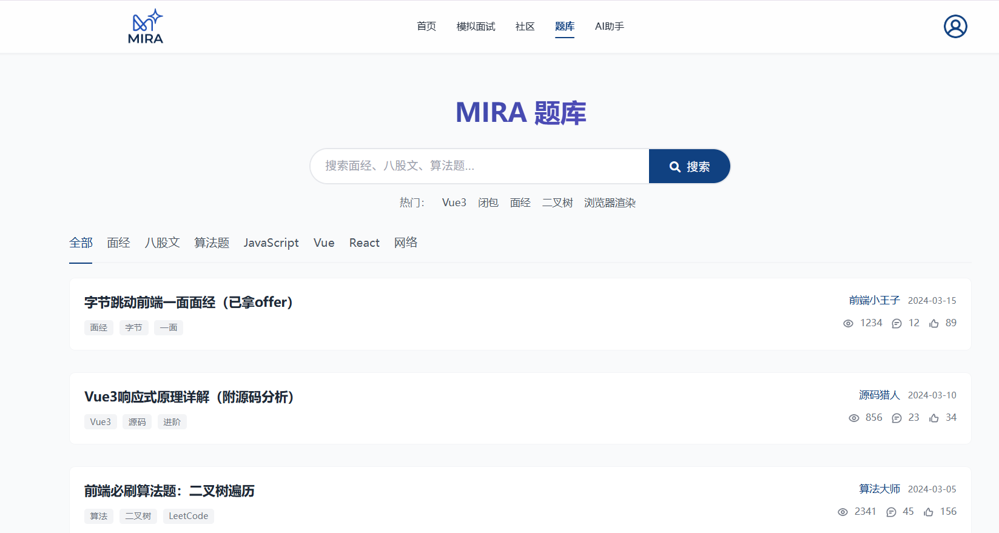
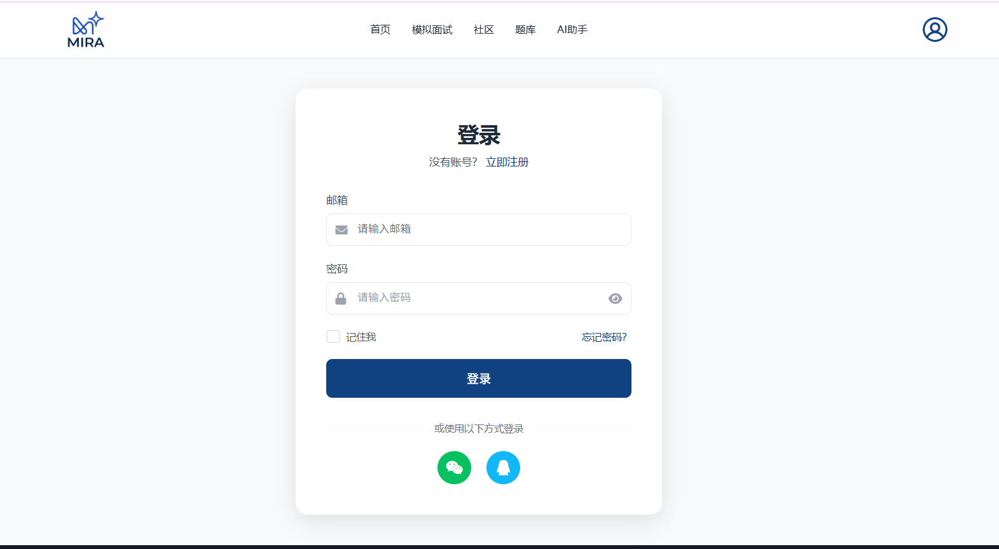
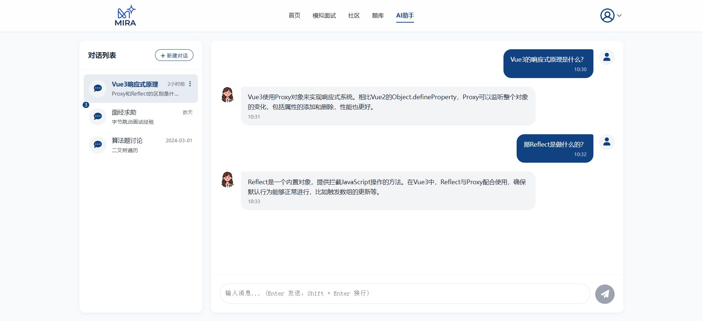
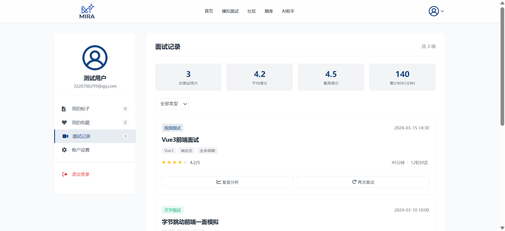
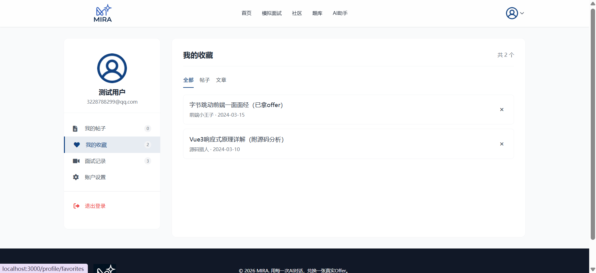
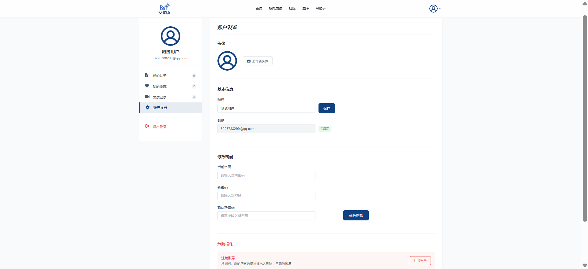

# MIRA — AI 模拟面试与个性化能力提升平台

面向求职者与大学生的 AI 模拟面试训练平台，包含模拟面试、专项训练、成长分析、社区交流等模块，帮助用户提升面试能力与职业竞争力。

> **关于本仓库**：此仓库仅上传 **前端静态页面部分**，用于展示页面布局、组件设计与交互 UI。完整项目中的后端接口对接（Axios 封装、40+ API）、语音识别（Web Speech API）、Markdown 渲染等与后端联动的功能模块未包含在本仓库中。仓库中的登录、面试、AI 助手等页面目前使用 mock 数据展示，仅运行前端无法完整体验全部功能。

## 本仓库技术栈

| 类别 | 技术 |
|------|------|
| 前端框架 | Vue 3（Composition API + `<script setup>`） |
| 构建工具 | Vite |
| 路由管理 | Vue Router 4 |
| 状态管理 | 响应式数据 + localStorage |
| 样式方案 | SCSS |
| 图标库 | Font Awesome 6 |

## 完整项目技术栈（含后端联调部分，未上传）

| 类别 | 技术 |
|------|------|
| 状态管理 | Pinia + localStorage |
| HTTP 请求 | Axios（Token 注入、401 拦截、异常提示） |
| 样式方案 | TailwindCSS |
| 语音交互 | Web Speech API（语音识别与音频录制） |
| 内容渲染 | Markdown 安全渲染 + 代码高亮与复制 |

## 功能模块

- **首页** — 平台介绍、热门推荐、联系我们
- **模拟面试** — AI 模拟面试完整交互流程，支持数字人视频面试与文字面试两种模式，覆盖 Java / Web 前端 / Python 岗位，多轮问答与评分结果可视化
- **专项训练** — 按知识点分类的面试题库，文章浏览与详情
- **社区交流** — 帖子发布浏览、帖子详情、收藏互动
- **AI 助手** — 智能对话辅助
- **个人中心** — 我的帖子、我的收藏、面试记录与详情、成长分析、账户设置
- **登录认证** — 路由守卫 + Token 认证，localStorage 持久化用户状态

## 项目亮点

1. 设计并搭建平台前端架构，完成 **20+** 功能页面开发，实现路由管理、组件复用与状态管理方案
2. 实现 AI 模拟面试完整交互流程，支持文字面试与数字人视频面试、多轮问答及评分结果可视化
3. 基于 **Web Speech API** 实现语音识别与音频录制功能，提升数字人面试交互体验
4. 使用 **Pinia + localStorage** 管理用户状态与训练会话，解决页面刷新导致的数据丢失问题
5. 封装 **Axios** 请求模块，统一处理 Token 注入、401 拦截与异常提示，对接 **40+** 后端接口
6. 实现 **Markdown 安全渲染、代码高亮与复制**功能，用于 AI 回复与社区内容展示

## 项目截图

<table>
  <tr>
    <td width="50%" align="center">
      <br>
      <b>平台首页</b> — 热门推荐与功能介绍
    </td>
    <td width="50%" align="center">
      <br>
      <b>首页底部</b> — 联系我们与页脚导航
    </td>
  </tr>
  <tr>
    <td width="50%" align="center">
      <br>
      <b>AI 模拟面试</b> — 数字人视频面试交互界面
    </td>
    <td width="50%" align="center">
      <br>
      <b>社区交流</b> — 帖子浏览、发布与收藏互动
    </td>
  </tr>
  <tr>
    <td width="50%" align="center">
      <br>
      <b>专项训练</b> — 按知识点分类的面试题库
    </td>
    <td width="50%" align="center">
      <br>
      <b>用户登录</b> — 账号认证与路由守卫
    </td>
  </tr>
  <tr>
    <td width="50%" align="center">
      <br>
      <b>AI 智能助手</b> — 对话式 AI 辅助答疑
    </td>
    <td width="50%" align="center">
      <br>
      <b>面试记录</b> — 历史面试记录与评分详情
    </td>
  </tr>
  <tr>
    <td width="50%" align="center">
      <br>
      <b>我的收藏</b> — 收藏的帖子与题目管理
    </td>
    <td width="50%" align="center">
      <br>
      <b>账户设置</b> — 个人信息与偏好配置
    </td>
  </tr>
</table>

## 快速开始

```bash
# 安装依赖
npm install

# 启动开发服务器
npm run dev

# 构建生产版本
npm run build

# 预览生产构建
npm run serve
```

## 项目结构

```
MIRA/
├── public/                  # 静态资源
├── src/
│   ├── assets/              # 图片等资源
│   ├── components/          # 公共组件
│   ├── router/              # 路由配置
│   ├── shared/              # 共享数据模块
│   ├── stores/              # Pinia 状态管理
│   ├── styles/              # 全局样式（SCSS）
│   ├── views/
│   │   ├── Home/            # 首页
│   │   ├── Community/       # 社区
│   │   ├── Knowledge/       # 题库 / 专项训练
│   │   ├── Interview/       # 模拟面试（数字人 & 文字）
│   │   ├── Chat/            # AI 助手
│   │   ├── Login/           # 登录
│   │   └── Profile/         # 个人中心
│   ├── App.vue
│   └── main.js
├── index.html
├── vite.config.js
└── package.json
```
